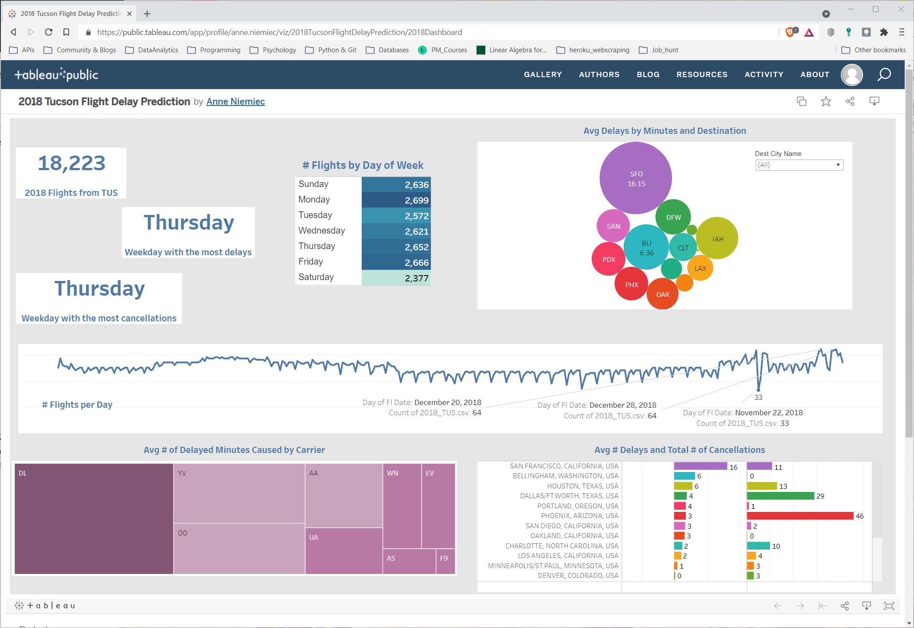

# flight_delay_prediction
UofA Data Analytics Bootcamp Final Group Project

**Team and Responsibilities**:  
* Nicole Lund: <a href="https://www.linkedin.com/in/nicolelund-1/" target="_blank">https://www.linkedin.com/in/nicolelund-1/</a>
    * Machine Learning Investigation, Tuning and Analysis
* Anne Niemiec: <a href="https://www.linkedin.com/in/anne-niemiec/" target="_blank">https://www.linkedin.com/in/anne-niemiec/</a>
    * Visualizations
* Tarak Patel: <a href="https://www.linkedin.com/in/tarakpatel-1/" target="_blank">https://www.linkedin.com/in/tarakpatel-1/</a>
    * Data wrangling and visualizations
* Amber Royster: <a href="https://www.linkedin.com/in/amber-royster/" target="_blank">https://www.linkedin.com/in/amber-royster/</a>
    * Webpage and Visualizations
    
## Problem
Employees with frequent business travel experience time lost with family and productive work time while in transit. In order to minimize lost time, past flight history was examined and modeled to predict which flight routes experienced the smallest delay times.

## Webpage
The project webpage contains detailed discussions and dashboards about the data investigation and modeling.

<a href="https://nicolelund.github.io/flight_delay_prediction/" target="_blank">https://nicolelund.github.io/flight_delay_prediction/</a>

## Project Highlights

### Resource and Scope Management
In order to manage project scope and operate within the constraints of the available tools, 2017 data was used to train and test machine learning models and the 2018 data was used to create visualizations and evaluate model predictions.  The data was further restricted to only model and predict flight disruptions for flights departing from Tucson International Airport (TUS).

### Visualizations
The 2018 TUS flight information was analyzed to investigate if there were interesting trends in the data.  A few insights included:

* The average carrier caused delay was 60 minutes for Delta flights (primary destination is ATL).  This means that when a carrier delay exists, Delta has the most difficult time overcoming it compared to other airlines.

<a href="https://public.tableau.com/views/2018TucsonFlightDelayPrediction/2018Dashboard?:language=en-US&:retry=yes&:display_count=n&:origin=viz_share_link" target="_blank">Anne Niemiec's Flight Summary Tableau Workbook</a>

* It is best to depart TUS for DFW in the morning. Delay times are highest for departures in the early to late evening.

<a href="https://public.tableau.com/views/Final_Project_TAP/InteractiveFlightAnalysis?:language=en-US&:retry=yes&:display_count=n&:origin=viz_share_link" target="_blank">Tarak Patel's Flight Details Tableau Workbook</a>

* In general, the number of delays and the average duration of delays associated with ATL and DFW destinations are not severely impacted by observed issues noted previously.

<a href="https://public.tableau.com/shared/P7N4TGYTN?:display_count=n&:origin=viz_share_link" target="_blank">Amber Royster's Flight Routes Tableau Workbook</a>

### Model Development
Several machine learning models were deployed and tuned with the same input/output data.  Each model was scored on accuracy and precision.  The best model generated used a random forest classification algorithm.  The model was trained with 70% of the 2017 data on the following features:

**Input values (known by customer)**
* OP_CARRIER: airline designation code
* OP_CARRIER_FL_NUM: flight number
* day_of_week: flight day of the week calculated from FL_DATE
* DEST: destination airport code
* CRS_DEP_TIME: scheduled departure time 
* CRS_ARR_TIME: scheduled arrival time
* DISTANCE: flight distance

**Output values (of interest to the customer)**
* CANCELLED: flight canceled [0 = No, 1 = Yes]
* DIVERTED: flight diverted [0 = No, 1 = Yes]
* DELAY: flight ARR_DELAY greater than 30 minutes [0 = No, 1 = Yes]

The Random Forest Classifier model was hyper-parameter tuned and then trained with 2017 training data using n_estimators=5000 and max_features= 'sqrt'.  This was scored against 2017 test data. The model's precision score for predicting delayed flights was below that which the team determined would be suitable for the defined use case.

Visualizing the 2017 test data confirms the poor precision score.

<a href="https://public.tableau.com/views/2017TUSflightdelayprediction/2017ModelTestingData?:language=en-US&:display_count=n&:origin=viz_share_link" target="_blank">Nicole Lund's Flight Delay Prediction Tableau Workbook</a>

### Predicting 2018 Flight Disruptions
Despite the low precision of the model, the team explored what would happen if the model was applied to 2018 flight data (18223 flights) to see if the model score would be analagous to the 2017 test data set.  We discovered that 3 new airlines and 3 new destinations were added to the Tucson International airport schedule in 2018 and that those 2823 flights could not be applied to the model. The 2018 data was split into two arrays: data that could be applied to the model and data that could not.  The data that could be applied to the model was then used to generate model predictions. The results of the predictions were:

| Description | Value |
|-----|-----|
| Overall Accuracy | 0.91 |
| Precision of Not Delayed Outcome | 0.91 |
| Precision of Delayed Outcome | 0 |

The precision of 2018's predicted delays was far worse than the 2017 testing data set.  Therefore, the team surmised that the addition of 2823 flights to the schedule would have severely impacted the flight schedules of the other 15400 departing flights and nullified any predictive capability of models trained with data prior to 2018. In addition to the new flights, the TUS airport remodeled both terminals, including remapping of airline gates between June 2016 and November 2017.  This would have also impacted the ability of the model to create valid predictions over the time frame investigated.

## Summary
Early on in the project the decision was made to analyze Tucson International Airport flights because of the airport's small size and small number of flights compared to other airports. This was done because transferring large data files and building models from large data sets takes a significant amount of time and computing resources. The discovery that the TUS airport experienced significant changes in 2017 and 2018 did not occur until the modeling was complete. However, the team recognized that the poor precision scores produced by the model were indicative of something important and further investigation provided a reasonable explanation. The TUS airport simply had too many changes over the time frame to reliably construct a predictive model.  It is unknown, how well this modeling approach would succeed on data from another airport that did not undergo such drastic changes. That would be interesting to investigate further.

## Source Data
The Kaggle dataset provides flight performance data for each year between 2009 and 2018. The full data set requires 7.1 Gb of storage space. <a href="https://www.kaggle.com/yuanyuwendymu/airline-delay-and-cancellation-data-2009-2018" target="_blank">https://www.kaggle.com/yuanyuwendymu/airline-delay-and-cancellation-data-2009-2018</a>

airport_codes.csv provides a lookup table of airport codes to city name. <a href="https://www.transportation.gov/policy/aviation-policy/airport-codes-txt" target="_blank">https://www.transportation.gov/policy/aviation-policy/airport-codes-txt</a>